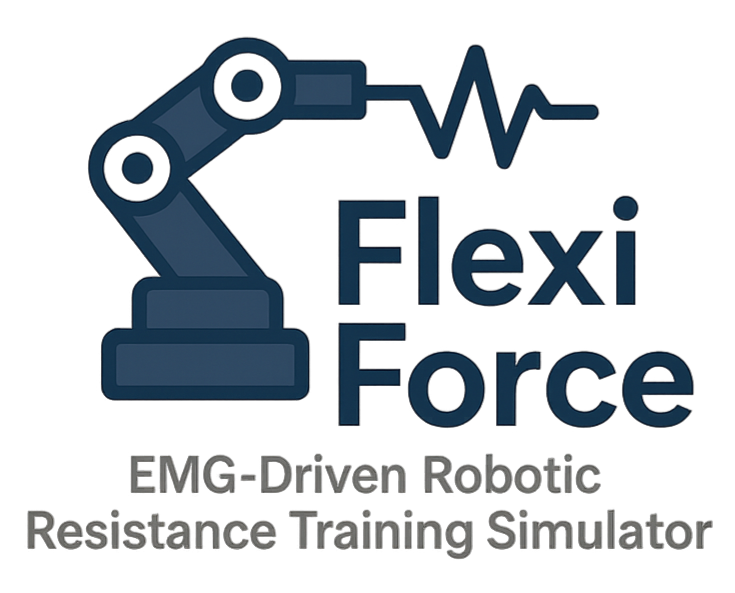

# FlexiForce: EMG-Driven Robotic Resistance Training Simulator

<p align="center">
  
</p>

<p align="center">
  
  
  
  
</p>

---

## Overview

FlexiForce simulates a personalized fitness and rehabilitation system where a redundant robotic arm (Franka Emika FP3) dynamically adjusts resistance based on real-time EMG data. Using MuJoCo for robotic simulation and OpenSim for muscle modeling, it implements a hybrid force-position controller that modulates end-effector resistance to keep user exertion aligned with a target % of max voluntary contraction.

**Key Highlights**:
- GUI for user-defined effort
- Real-time EMG feedback
- Redundant robot arm simulation
- Modular controllers for benchmarking

## Features

- Closed-loop EMG feedback control
- Real-time GUI-based effort input
- Force-position hybrid control architecture
- Support for both OpenSim and custom muscle models
- Performance-optimized simulation in MuJoCo

## Architecture

```
[ GUI Input (Target Effort) ] 
        ↓ 
[ Controller: Hybrid Force-Position ]
        ↓
[ MuJoCo Robot Arm ] ←→ [ OpenSim / EMG Model ]
        ↑                            ↓
    [ Force Output ] ←── Feedback Loop ──→ [ EMG Activation ]
```

## Installation

### 1. Clone the Repository

```bash
git clone --recurse-submodules https://github.com/aaronjohnsabu1999/flexiforce.git
cd flexiforce
```

If you forgot `--recurse-submodules`:
```bash
git submodule update --init --recursive
```

### 2. Create a Virtual Environment (Recommended)

```bash
python -m venv venv
```

Activate it:
- macOS/Linux: `source venv/bin/activate`
- Windows: `venv\Scripts\activate`

### 3. Install Dependencies

```bash
pip install -r requirements.txt
```

#### On Linux:
```bash
sudo apt update && sudo apt install -y python3-tk
```

#### On Windows:
Tkinter is bundled with Python. To check:
```bash
python -m tkinter
```

## 🐧 WSL2 Setup Instructions (Ubuntu/Debian)

### Step 1: Install Required Packages

```bash
sudo apt update
sudo apt install -y python3-tk libgl1-mesa-glx libglu1-mesa mesa-utils
```

### Step 2: Launch X Server on Windows

Install and start [VcXsrv](https://sourceforge.net/projects/vcxsrv/):

- ✅ Multiple windows
- ✅ Start no client
- ✅ Disable access control
- 🔁 Try both with/without Native OpenGL

### Step 3: Export Display Settings

In `~/.bashrc` or before running:
```bash
export DISPLAY=:0
export LIBGL_ALWAYS_INDIRECT=0
```
Reload with:
```bash
source ~/.bashrc
```

### Step 4: Test with glxgears

```bash
glxgears
```

If gears spin, OpenGL is working.

### Step 5: Run the Simulation

```bash
python3 main.py
```

- ✅ GUI will open via Tkinter
- ✅ MuJoCo viewer will render (if OpenGL works)
- 🔁 Headless fallback if viewer fails

## Troubleshooting

- **No MuJoCo viewer?** Ensure VcXsrv is running and `DISPLAY` is set.
- **OpenGL errors?** Try `export LIBGL_ALWAYS_INDIRECT=1`
- **Still broken?** Run in native Windows with Python + MuJoCo setup.

## License

MIT License. See `LICENSE.md`.

## Authors

- Ben Forbes  
- Samantha Herman  
- Aaron John Sabu  

Course project for **MAE 263C** – University of California, Los Angeles

## License

MIT License. See `LICENSE.md` for details.

## Acknowledgments

- Dr. Veronica Santos – MAE 263C
- OpenSim and MuJoCo dev teams
- Everyone who tolerates noisy EMG data and still finds signal in the chaos
