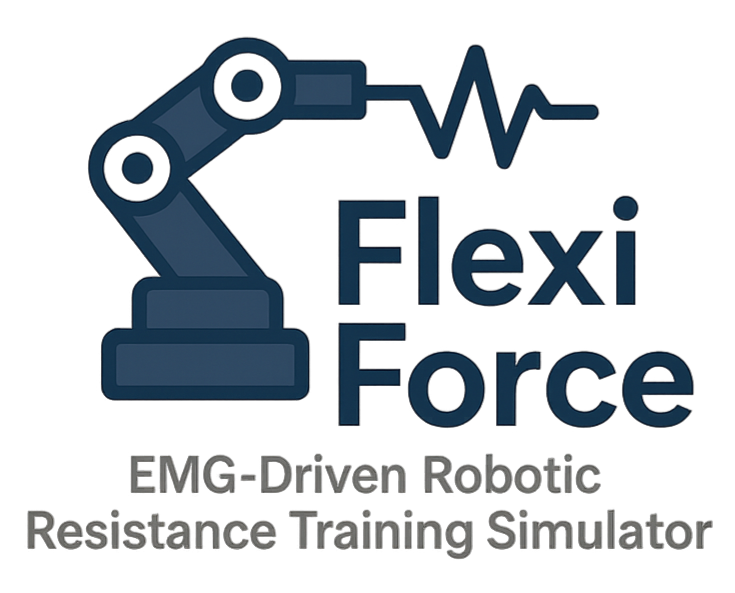

<p align="center">
  
</p>

<h1 align="center">FlexiForce: EMG-Driven Robotic Resistance Training Simulator</h1>

<p align="center">
  
  
  
  
</p>

---

## Overview

This project simulates a personalized fitness and rehabilitation system where a redundant robotic arm (Franka Emika FP3) dynamically adjusts resistance based on real-time EMG data. Using MuJoCo for robotic simulation and OpenSim for muscle modeling, we implement a hybrid force-position controller that modulates end-effector resistance to keep user exertion aligned with a target % of max voluntary contraction. 

Includes:
- A GUI for user-defined intensity
- Real-time EMG-responsive feedback control
- Three independently tuned controllers battling it out for stability supremacy

Perfect blend of biomechanics, robotics, and control theory.

## Features

- **Closed-loop feedback** using EMG data and force modulation
- **Redundant robot simulation** (Franka Emika FP3) via MuJoCo
- **EMG activation modeling** using OpenSim or custom Hill-type dynamics
- **GUI** for user-specified exertion levels (e.g., 60% MVC)
- **Hybrid force-position control** with compliance and stability focus
- **Controller benchmarking** based on performance and robustness

## Architecture

```
[ GUI Input (Target Effort) ] 
        ↓ 
[ Controller: Hybrid Force-Position ]
        ↓
[ MuJoCo Robot Arm ] ←→ [ OpenSim / EMG Model ]
        ↑                            ↓
    [ Force Output ] ←── Feedback Loop ──→ [ EMG Activation ]
```

## Demo

Coming soon: Video of the system in action!

## Installation

### 1. Clone the Repository (with submodules)
```bash
git clone --recurse-submodules https://github.com/aaronjohnsabu1999/flexiforce.git
cd flexiforce
```

> 💡 If you forgot `--recurse-submodules`, run:
> ```bash
> git submodule update --init --recursive
> ```

---

### 2. (Optional but recommended) Set Up a Virtual Environment
```bash
python -m venv venv
```

**Activate it:**
- macOS/Linux:
  ```bash
  source venv/bin/activate
  ```
- Windows:
  ```cmd
  venv\Scripts\activate
  ```

---

### 3. Install Dependencies

```bash
pip install -r requirements.txt
```

If you're on **Linux**, install `tkinter` (needed for GUI):

```bash
sudo apt update && sudo apt install -y python3-tk
```

If you're on **Windows**, `tkinter` comes bundled with Python — but double-check it works:

```bash
python -m tkinter
```

A little window should pop up. If not, reinstall Python from [python.org](https://www.python.org/) and make sure **"tcl/tk and IDLE"** is checked during setup.

Ensure that MuJoCo and OpenSim Python bindings are installed correctly.

<!-- ## Project Structure

```
flexiforce/
├── controller/         # Hybrid control logic
├── gui/                # User interface (PyQt or Tkinter)
├── mujoco_sim/         # Robot simulation (Franka Emika FP3)
├── emg_model/          # OpenSim interface or custom EMG model
├── results/            # Plots and Gantt chart
├── requirements.txt
└── README.md
``` -->

## Authors

- Ben Forbes  
- Samantha Herman  
- Aaron John Sabu  

Course project for **MAE 263C** – University of California, Los Angeles

## License

MIT License. See `LICENSE.md` for details.

## Acknowledgments

- Dr. Veronica Santos – MAE 263C
- OpenSim and MuJoCo dev teams
- Everyone who tolerates noisy EMG data and still finds signal in the chaos
